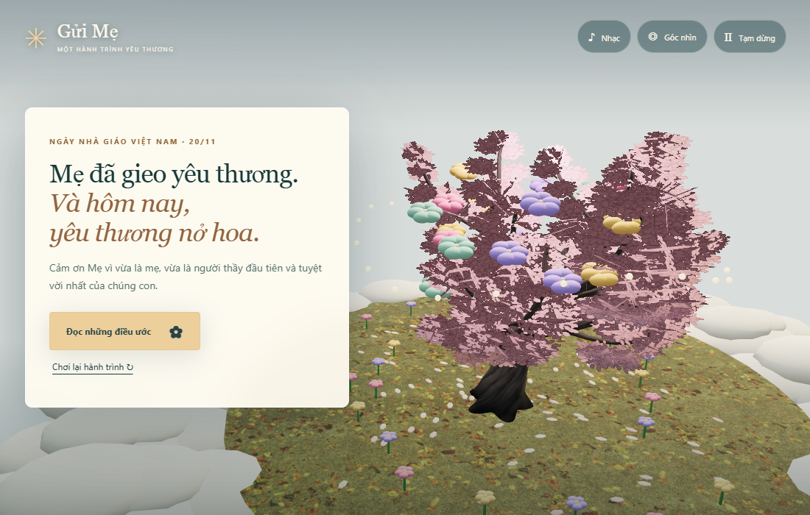

# Gửi Mẹ · Người gieo những mùa hoa

Một hành trình 3D dành tặng Mẹ nhân ngày Nhà giáo Việt Nam 20/11. Mẹ bước qua khu vườn trên mây, đến lớp đón 25 lời chúc, trở về gặp gia đình và ngắm cây điều ước nở hoa.



## Chạy dự án

Cần Node.js 22 trở lên. Tài nguyên đã nằm trong repository.

```bash
npm ci
npm run build
npm run dev
```

Mở **http://127.0.0.1:8123**. Khi sửa JavaScript, chạy lại `npm run build` rồi tải lại trang. CSS và HTML ở thư mục gốc được server đọc trực tiếp. Thư mục `site/` là bản dựng độc lập để triển khai; `node tools/serve.mjs --site` xem đúng bản dựng đó.

## Điều khiển

- Bấm **Bắt đầu hành trình**, rồi dùng nút nhiệm vụ để tiếp tục từng chặng.
- Kéo chuột hoặc một ngón tay để xoay camera; cuộn hoặc chụm hai ngón để zoom.
- **Enter** tiếp tục; **Esc** mở/đóng tạm dừng; **R** đặt lại camera.
- Nút **Nhạc** bật bản nhạc nhẹ được tạo bằng Web Audio. Nhạc không tự phát.
- Tạm dừng cho phép chọn **Nhẹ**, **Cân bằng** hoặc **Điện ảnh**, và giảm chuyển động camera tự động.
- Tiến trình được lưu sau mỗi chặng. Khi quay lại, bấm **Tiếp tục hành trình đã lưu**. Đang di chuyển giữa các chặng thì tiếp tục từ chặng hoàn chỉnh gần nhất.
- Ở cuối hành trình, đọc toàn bộ 24 điều ước hoặc chạm vào các bông hoa, rồi chơi lại nếu muốn.

## Hình ảnh và công nghệ

Three.js, JavaScript ES modules và esbuild. Nhân vật áo dài xanh, cây 3D, vật liệu PBR, vườn hoa dùng instancing, ánh sáng ấm và giao diện điện ảnh thống nhất. Mức Điện ảnh có bloom, SSAO và bóng 2048px; mức Nhẹ bỏ hậu kỳ và bóng để giảm tải.

Model và texture local khoảng **4 MB**; JavaScript được bundle local. Không cần CDN hay backend khi chơi. Các tài nguyên có nguồn gốc và giấy phép trong [ASSET_CREDITS.md](ASSET_CREDITS.md). WebGL 2 là yêu cầu bắt buộc.

## Kiểm thử

```bash
npm test
npx playwright install chromium
npm run build
npm run test:e2e
```

Hoặc `npm run check` sau khi cài browser. Trên Windows, cấu hình kiểm thử dùng Chrome đã cài; trên Linux dùng Chromium của Playwright. Bộ kiểm thử kiểm tra tài nguyên GLB, đường đi toàn thân, thời gian tạm dừng, lưu tiến trình và chơi thật từ đầu đến cuối; đồng thời kiểm tra mobile, các mức đồ họa và model dự phòng. Ảnh kiểm thử nằm trong `test-results/`.

## Chỉnh nội dung

`src/config.js` chứa 25 lời chúc trong lớp, 24 điều ước, lời thoại và mô tả mười chặng. `src/world-spec.mjs` chứa đường đi, collider và sàn/cầu thang dùng chung giữa game và QA. `src/visuals.js` quản lý đồ họa; `src/journey.mjs` quản lý đường đi, bộ đếm thời gian và dữ liệu lưu.

## Phát hành

Workflow `.github/workflows/vendor-three.yml` kiểm thử và dựng `site/`. Pull request chỉ chạy kiểm tra; khi cập nhật `main`, workflow xuất bản bản đã kiểm tra lên nhánh `gh-pages` hiện có, giữ lịch sử Git. GitHub Pages tiếp tục dùng **Deploy from a branch → gh-pages → / (root)**.

Bản này là một trải nghiệm web 3D được hoàn thiện theo phong cách hoạt hình điện ảnh. Hiệu năng phụ thuộc GPU; không tuyên bố đạt chất lượng sản xuất AAA hay hoàn hảo trên mọi thiết bị. Chi tiết thay đổi và phạm vi kiểm chứng: [docs/RELEASE_V18.md](docs/RELEASE_V18.md).
